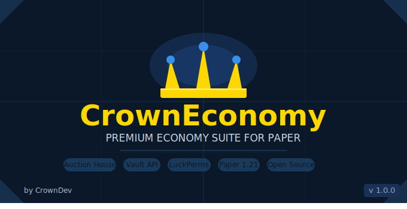

# 💰 CrownEconomy

> **The best economy plugin for Paper, Purpur, Spigot, and Bukkit servers.** Premium auction house, stunning GUIs, 100% customizable. Built for survival, SMP, factions, and RPG servers.

<p align="center">
  
</p>

<p align="center">
  
  
  
</p>


[](https://github.com/FrostedGuy0/CrownEconomy)
[](https://hangar.papermc.io/FrostedGuy/CrownEconomy)
[](https://discord.gg/cCUVWxcuAw)

**CrownEconomy** is the best economy plugin and best auction house plugin for Paper, Purpur, Spigot, and Bukkit 1.21.1 servers. If you're looking for a simple, powerful, and 100% customizable economy suite that your players will actually enjoy, you've found it.

Clean bordered GUIs. Instant feedback. Smart expiry handling. Deep configuration. **Vault-compatible** out of the box. No bloat, no ugly menus, no compromises.

Supports Paper, Purpur, Spigot, and Bukkit 1.21.1+.

Whether you're building a survival economy, an SMP marketplace, or a full RPG server, **CrownEconomy** is the last economy plugin you'll ever need.

---

## 🔍 Why CrownEconomy?

Every other auction house plugin for modern Minecraft servers either looks outdated, barely configures, or breaks under load. CrownEconomy was built from scratch to be the definitive, modern answer to server economy:

- 🏆 **Best auction house plugin** for Paper, Purpur, Spigot, and Bukkit 1.21.1, cleaner, faster, and more configurable than anything else
- 🎨 **100% customizable** - every GUI title, filler material, button icon, message, price limit, tax rate, and border element
- ⚡ **Simple & lightweight** - drop-in install, zero database setup required, fully running in under 5 minutes
- 🏦 **Vault-compatible** - seamless integration with EssentialsX, GemsEconomy, CMI, and every Vault economy plugin
- 🔐 **LuckPerms integration** - give VIPs, MVPs, and donors more listing slots automatically via permissions
- 🛡️ **Offline seller payouts** - sellers always get paid, even if they're offline when their item sells
- 📦 **Configurable market flow** - clean browsing, categories, search, my listings, and transactions history
- 💾 **Reliable data saving** - listings and player transactions are saved automatically, so nothing is lost
- 🗺️ **Actively developed** - built to grow with more economy features over time
- 💬 **Dedicated support** - active Discord with fast responses and a growing community

---

## 🏛️ Auction House Features

> The most polished, feature-rich, and player-friendly AH plugin available for 1.21.1 servers.

### 🖥️ GUI & Browsing
- **Clean centered browsing GUI** - readable layout with no clutter
- **Configurable listing slots** - fully controlled from `gui.yml`
- **4 sort modes** - Low -> High, High -> Low, Soon -> New, New -> Soon
- **Category filters** - All, Weapons, Armor, Tools, Resources, Food, and Blocks
- **Live search** - search by item name, seller name, or material
- **Confirm purchase screen** - full breakdown of item, price, tax, and seller before any money moves
- **Refresh support** - refresh the current menu without reopening the whole flow

### 💸 Economy & Listings
- **Configurable tax system** - set any percentage cut taken from the seller on each sale
- **Min & max price limits** - prevent price dumping or price gouging with hard server-wide limits
- **Global AH cap** - limit how many active listings can exist at once
- **Per-rank listing slots** - VIPs and donors automatically get more listing slots via permissions
- **Offline seller payouts** - Vault balance credited the moment an item sells, online or not
- **Material blacklist** - permanently block any item or material from ever being listed
- **Permanent or timed listings** - set duration to `0` for permanent listings

### 📦 Listing Management
- **My Listings panel** - dedicated GUI for players to view and right-click cancel their own listings
- **Transactions GUI** - track listed, purchased, sold, cancelled, and expired activity
- **Transaction stats** - see total sold worth and total bought worth
- **Expired item handling** - unsold items auto-return on expiry
- **Configurable expiry duration** - set exactly how long listings stay active before expiring
- **Listing data persistence** - every listing saved on create, purchase, cancel, expiry, and shutdown

---

## 🔌 Dependencies

### Required
- **Paper, Purpur, Spigot, or Bukkit 1.21.1** or a compatible fork
- **Vault**
- **A Vault-compatible economy plugin**

### Recommended
- **LuckPerms** for rank-based listing limits and permission tiers

### Compatible With
- EssentialsX Economy
- GemsEconomy
- CMI Economy
- Any other Vault-compatible economy plugin


---

## 🔌 Compatibility

| 🔧 Integration | ✅ Status | 📋 Notes |
|---|---|---|
| **Vault** | ✅ **Required** | Economy bridge for balance, withdraw, and deposit |
| **Paper 1.21.1** | ✅ **Required** | Primary supported platform |
| **Purpur** | ✅ Compatible | Paper fork fully supported |
| **Spigot 1.21.1** | ✅ Compatible | Bukkit/Spigot API supported |
| **Bukkit 1.21.1** | ✅ Compatible | Bukkit API supported |
| **LuckPerms** | ⭐ Recommended | Per-rank listing slot tiers |
| **EssentialsX Economy** | ✅ Full support | Via Vault |
| **GemsEconomy** | ✅ Full support | Via Vault |
| **CMI Economy** | ✅ Full support | Via Vault |
| **Any Vault economy** | ✅ Full support | If it hooks Vault, it works |

> ⚠️ **Required:** Vault + any Vault-compatible economy plugin  
> ⭐ **Recommended:** LuckPerms for per-rank listing tiers

---

## ⚙️ Configuration

> 100% customizable - nothing is hardcoded. Core values live in `config.yml`, GUI layout lives in `gui.yml`, and all text lives in `messages.yml`.

```yml
general:
  prefix: "&8[&bCrown &3Economy&8] &r"
  currency-symbol: "$"
  decimal-places: 2

auction-house:
  enabled: true
  max-auction-house-listings: 0
  max-transaction-history: 0
  min-price: 1.0
  max-price: 1000000.0
  default-duration-hours: 0
  max-duration-hours: 168
  tax-rate: 5.0
  auto-save-seconds: 60
  expiry-check-seconds: 60
  return-check-seconds: 60

  listing-limits:
    - permission: "crowneconomy.admin"
      limit: 100
    - permission: "crowneconomy.ah.maxlistings.mvp"
      limit: 20
    - permission: "crowneconomy.ah.maxlistings.vip"
      limit: 10
    - permission: "default"
      limit: 5
```

### 🎨 What You Can Customize
- 🖼️ Every **GUI title, filler material, button icon, slot, and border element**
- 💬 Every **player-facing message** - full `&` color codes and `{placeholders}` throughout
- 💰 **Min/max listing price**, **tax rate**, **listing duration**, **global listing cap**, **transaction history cap**
- 🏅 **Per-rank listing limits** via permissions
- 🔘 **Module toggles** - enable or disable the AH independently
- 🚫 **Material blacklist** - block any item by name, keep your economy clean
- 🏷️ **Prefix and currency formatting** - customize the default branding and money display

---

## 📋 Commands

| 💬 Command | 📖 Description | 🔐 Permission |
|---|---|---|
| `/ah` | Open the Auction House | `crowneconomy.ah.open` |
| `/ah help` | Show AH help | *(any player)* |
| `/ah sell <price>` | List your held item for sale | `crowneconomy.ah.sell` |
| `/ah search <query>` | Search all active listings | `crowneconomy.ah.search` |
| `/ah mylistings` | View your own listings | `crowneconomy.ah.open` |
| `/ah cancel <id>` | Cancel one of your listings | `crowneconomy.ah.cancel` |
| `/ah refresh` | Refresh the open menu | `crowneconomy.ah.open` |
| `/ce` | Show CrownEconomy help | *(any player)* |
| `/ce help` | Show the command help | *(any player)* |
| `/ce reload` | Reload the plugin config | `crowneconomy.reload` |
| `/ce refresh` | Refresh the plugin | `crowneconomy.refresh` |
| `/ce version` | Show plugin version & status | *(any player)* |

**Aliases:** `/auctionhouse` · `/ceconomy` · `/ce`

---

## 🔐 Permissions

| 🔑 Permission | 👤 Default | 📋 Description |
|---|---|---|
| `crowneconomy.ah.open` | `true` | Open the Auction House GUI |
| `crowneconomy.ah.sell` | `true` | List items for sale |
| `crowneconomy.ah.bid` | `true` | Purchase listings |
| `crowneconomy.ah.cancel` | `true` | Cancel own listings |
| `crowneconomy.ah.cancel.others` | `op` | Cancel any listing (staff) |
| `crowneconomy.ah.search` | `true` | Use live search |
| `crowneconomy.ah.maxlistings.vip` | `false` | VIP - 10 listing slots |
| `crowneconomy.ah.maxlistings.mvp` | `false` | MVP - 20 listing slots |
| `crowneconomy.admin` | `op` | Full admin access + 100 slots |
| `crowneconomy.reload` | `op` | Reload config via command |
| `crowneconomy.refresh` | `op` | Refresh plugin state |

---

## 🛠️ Installation

> ⏱️ Up and running in under 5 minutes.

1. 🖥️ Ensure you're running **Paper, Purpur, Spigot, or Bukkit 1.21.1** or a compatible fork
2. 🏦 Install **Vault** and a Vault economy plugin such as EssentialsX Economy, GemsEconomy, or CMI Economy
3. 🔐 *(Recommended)* Install **LuckPerms** for rank-based listing limits
4. 📂 Drop `CrownEconomy.jar` into your `/plugins/` folder
5. 🔄 Start or restart your server
6. ✏️ Edit `plugins/CrownEconomy/config.yml`, `gui.yml`, and `messages.yml` to your liking
7. ▶️ Use `/ce reload` or `/ce refresh` to apply changes

> ⚠️ **Reload note:** `/ce reload` reloads configuration and refreshes the plugin state. Active listing data is **not** wiped.

---

## 🗂️ Data Storage

> 💾 Your listings are always safe - CrownEconomy saves on every action.

- ✅ Saved on every listing **create**, **purchase**, **cancel**, and **expiry**
- ✅ Saved on every clean **server shutdown**
- ✅ Persisted in `plugins/CrownEconomy/auction-data.yml`
- ✅ Auto-save, expiry checks, and return checks run in the background
- 📌 No database setup required

---

## 🚧 Roadmap

> CrownEconomy is just getting started. The full economy suite is on the way.

| 🔮 Module | 📋 Description | 🚦 Status |
|---|---|---|
| 🏛️ **Auction House** | Full-featured server marketplace | ✅ Released |
| 🛒 **Player Shop** | Chest or GUI shops with auto-restock | 🔄 Planned |
| 💱 **Trading System** | Secure face-to-face player trades | 🔄 Planned |
| 🏦 **Bank System** | Account interest, shared balances | 🔄 Planned |
| 📊 **Economy Stats** | Server leaderboards, transaction history | 🔄 Planned |

---

## 🎯 Perfect For

- 🌲 **Survival servers** - give players a real marketplace to trade resources
- 👥 **SMP servers** - the go-to economy layer for any multiplayer survival experience
- ⚔️ **Factions servers** - control the economy with taxes, blacklists, and rank limits
- 🧙 **RPG servers** - fits naturally into any custom economy and progression system
- 🏙️ **Towny servers** - player-driven markets with full Vault integration
- 💎 **Donor-tier servers** - reward VIPs and MVPs with more listing slots automatically

---

## 💬 Support & Community

> 🙋 Need help? Have a suggestion? Join the Discord.

**👉 Join our Discord - discord.gg/cCUVWxcuAw**

- 💬 **#support** - get help with installation, config, and permissions
- 🐛 **#bug-reports** - report issues with full details and get fast fixes
- 💡 **#suggestions** - suggest features and vote on the roadmap
- 📢 **#announcements** - be first to know about new releases and updates

### 🐛 Bug Reports
When reporting a bug, please include:
- 📄 Your server version (`/version`)
- 🔢 Your CrownEconomy version (`/ce version`)
- 📋 Any relevant errors from your server console

---

## 📜 License

CrownEconomy is a **premium resource**. You may install and use it on your own servers. You may **not** redistribute, resell, decompile, or claim ownership of this plugin or its source code.

---

*🏗️ Built for Paper, Purpur, Spigot, and Bukkit 1.21.1 · ⚠️ Requires Vault · ⭐ Recommends LuckPerms · ✅ Compatible with EssentialsX, GemsEconomy, CMI, and all Vault economy plugins*
