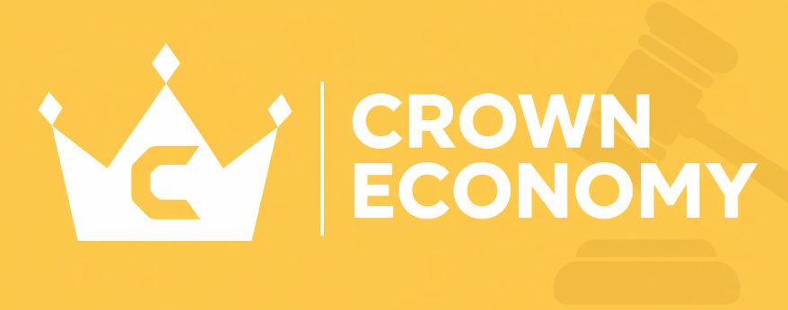

# 💰 CrownEconomy

> **The complete economy suite for Paper, Purpur, Spigot, and Bukkit servers.** Server shop, auction house, player shops, secure trading, banking, and economy stats. Works with **or without Vault**. Stunning GUIs, 100% customizable.

<p align="center">
  
</p>

<p align="center">
  <a href="https://ko-fi.com/frostedguy">
    
  </a>
</p>

<p align="center">
  
  
  
</p>

<p align="center">
  
  
  
</p>

[](https://github.com/FrostedGuy0/CrownEconomy)
[](https://hangar.papermc.io/FrostedGuy/CrownEconomy)
[](https://discord.gg/cCUVWxcuAw)

**CrownEconomy** is the all-in-one economy plugin for Paper, Purpur, Spigot, and Bukkit 1.21.8+ servers. One jar replaces your shop plugin, your auction plugin, your trade plugin, your bank plugin, and your economy plugin.

- 🏪 **Server Shop** - section based admin shop with a quantity screen, sell hand, and sell all
- 🏛️ **Auction House** - the full player marketplace
- 🛒 **Player Shops** - chest or GUI shops with auto-restock
- 💱 **Trading System** - secure face-to-face player trades
- 🏦 **Bank System** - interest, shared balances, member management
- 📊 **Economy Stats** - server leaderboards and transaction history

It also ships its **own economy**, so Vault is completely optional. No economy plugin installed? CrownEconomy handles balances itself and publishes them to Vault so the rest of your server can use them.

Every module can be switched on or off independently, so you can run the whole suite or only the parts you want.

---

## 🆕 What's New in 3.0.0

**The Economy Suite Update.** CrownEconomy grew from an auction house into a full economy suite.

- 🏪 **New: Server Shop** - EconomyShopGUI style sections, quantity screen, `/sell` and `/sell all`
- 🛒 **New: Player Shops** - chest and virtual shops with auto-restock at `/pshop`
- 💱 **New: Trading** - secure face-to-face trades with rollback protection
- 🏦 **New: Bank** - personal and shared accounts with scheduled interest
- 📊 **New: Economy Stats** - 10 leaderboards, `/baltop`, and server transaction history
- 🪙 **New: Built-in economy** - Vault is now optional, and CrownEconomy can be your economy plugin
- 🎨 **New: Modern GUI system** - hex and gradient colors, player head balances, back arrows, sounds
- 🔤 **New: PlaceholderAPI + LuckPerms** integration, including AxLeaderboards support
- ⚠️ **Breaking:** `/shop` now opens the server shop. Player shops moved to `/pshop`

Full release notes: [CHANGELOG.md](CHANGELOG.md)

---

## 🔍 Why CrownEconomy?

- 🏆 **Six modules, one jar** - shop, auction house, player shops, trading, bank, and stats sharing the same config, GUI, and message files
- 🎨 **Modern GUI system** - hex and gradient colors, player head balance buttons, a back arrow on every screen, short readable tooltips, and menu sounds
- 🪙 **Works with or without Vault** - use any Vault economy, or let CrownEconomy be your economy
- 📐 **100% customizable** - every GUI title, size, slot, filler, sound, icon, message, price, tax, limit, and timer
- 🔐 **LuckPerms aware** - limits and sell multipliers from LuckPerms meta, with permission tiers as a fallback
- 🔤 **PlaceholderAPI ready** - balances, bank, stats, shops, and full leaderboard placeholders
- 🥇 **Leaderboard plugin friendly** - AxLeaderboards, Featherboard, TAB, and any PAPI based plugin can read the built-in boards
- 🛡️ **Offline payouts** - sellers and shop owners always get paid, even when they are offline
- 🔒 **Safe by design** - trades roll back on failure, shop containers are protected, and every module validates before money moves
- 💾 **Reliable data saving** - everything saves on an interval, off the main thread, and on shutdown
- 💬 **Dedicated support** - active Discord with fast responses and a growing community

---

## 🪙 Economy: Vault Optional

CrownEconomy never forces you into a particular setup.

| Setup | What happens |
|---|---|
| Vault + an economy plugin | CrownEconomy hooks the Vault economy and uses it everywhere |
| Vault, no economy plugin | The built-in economy activates and **registers itself with Vault**, so other plugins work too |
| No Vault at all | The built-in economy runs on its own, stored in `balances.yml` |

```yaml
economy:
  provider: AUTO          # AUTO / VAULT / INTERNAL
  internal:
    starting-balance: 100.0
    currency-name-singular: "Coin"
    currency-name-plural: "Coins"
    register-with-vault: true
```

Built-in economy commands:

```bash
/ce balance [player]
```

```bash
/ce pay <player> <amount>
```

```bash
/ce eco <give|take|set> <player> <amount>
```

`/ce version` shows exactly which provider is live.

---

## 🏪 Server Shop

> A full EconomyShopGUI style admin shop, defined in `shop.yml` and open at `/shop`.

- **Modern layout** - gradient title, glass bottom bar, your player head showing your live balance and sell multiplier, and a back arrow in the bottom-left
- **Section menu** - browse categories such as Blocks, Ores, Farming, Food, Mob Drops, Redstone, Decoration, Tools, Brewing, and Misc
- **Ten ready-made sections** - a complete priced catalogue ships out of the box, edit or replace anything
- **Buy and sell prices** - every item can be buy only, sell only, or both
- **Quantity screen** - middle-click any item for a +1 / +8 / +16 / +32 / +64 amount selector with live prices
- **Fast clicks** - left click buys one, shift-left buys a stack, right click sells one, shift-right sells everything you carry
- **Sell hand and sell all** - `/sell` and `/sell all`, plus a Sell Inventory button in the GUI
- **Per-section permissions** - lock a section behind any permission node
- **Sell multipliers** - reward ranks with higher payouts through LuckPerms meta or permission tiers
- **Sell tax** - optional server cut on every sale
- **Custom slots** - pin sections and items to exact slots, or leave it blank for automatic paging
- **Live reload** - `/shop reload` applies `shop.yml` changes without a restart

```yaml
sections:
  ores:
    display-name: "&bOres"
    icon: DIAMOND
    slot: 12
    size: 54
    permission: ""
    items:
      diamond:
        material: DIAMOND
        amount: 1
        buy-price: 450.0
        sell-price: 120.0
```

---

## 🏛️ Auction House

> The most polished, feature-rich, and player-friendly AH available for modern servers.

### 🖥️ GUI & Browsing
- **Clean centered browsing GUI** - readable layout with no clutter
- **Configurable listing slots** - fully controlled from `gui.yml`
- **4 sort modes** - Low -> High, High -> Low, Soon -> New, New -> Soon
- **Category filters** - All, Weapons, Armor, Tools, Resources, Food, and Blocks
- **Live search** - search by item name, seller name, or material with a chat-free sign prompt
- **Confirm purchase screen** - full breakdown of item, price, tax, and seller before any money moves

### 💸 Economy & Listings
- **Configurable tax system** - set any percentage cut taken from the seller on each sale
- **Min & max price limits** - prevent price dumping or price gouging
- **Global AH cap** - limit how many active listings can exist at once
- **Per-rank listing slots** - through permissions or LuckPerms meta
- **Offline seller payouts** - balance credited the moment an item sells, online or not
- **Material blacklist** - permanently block any item from being listed
- **Permanent or timed listings** - set duration to `0` for permanent listings

### 📦 Listing Management
- **My Listings panel** - view and right-click cancel your own listings
- **Transactions GUI** - listed, purchased, sold, cancelled, and expired activity with totals
- **Expired item handling** - unsold items auto-return on expiry
- **Listing data persistence** - saved on create, purchase, cancel, expiry, and shutdown

---

## 🛒 Player Shops

> Player run shops at `/pshop`, as chest shops or GUI shops, with automatic restocking.

- **Chest shops** - link a chest, trapped chest, or barrel and players right-click it to open the shop
- **GUI shops** - no build required, every open shop is listed inside `/pshop`
- **Auto-restock** - stock flows from the linked container on a configurable interval
- **Per-item restock toggle** and an instant Restock button
- **Bundle pricing** - list "16 iron ingots for $100" by holding a stack of 16 when you add it
- **Bulk clicks** - shift-click multiplies the amount by a configurable multiplier
- **Owner funds check** - players can only sell to a shop when the owner can actually pay
- **Per-rank shop limits** - permissions or LuckPerms meta
- **Container protection** - linked containers cannot be broken or blown up by anyone but the owner
- **Safe deletion** - deleting a shop returns all stored stock to the owner

---

## 💱 Trading System

> Secure, scam-proof, face-to-face trades. No chat commands mid-trade, no dropped items, no trust required.

- **Split trade window** - your half on the left, theirs on the right, shared live between both players
- **Request flow** - `/trade <player>`, then `/trade accept`, with configurable request expiry
- **Money offers** - add coins with click, shift-click, and middle-click steps
- **Confirmation reset** - any change to items or money instantly clears both confirmations
- **Atomic execution** - money and items only move once both sides confirm, and every transfer is checked first
- **Automatic rollback** - closing the window, disconnecting, or walking away returns everything
- **Distance and timeout checks** - abandoned or out-of-range trades clean themselves up
- **Inventory space check** - a trade never completes into a full inventory

---

## 🏦 Bank System

> Interest-bearing accounts, shared team balances, and a clean deposit and withdraw GUI.

- **Personal vault** - every player gets an account automatically
- **Shared accounts** - invite members for towns, factions, guilds, or friends
- **Member management** - invite, accept, kick, and leave, with a configurable member cap
- **Scheduled interest** - configurable rate, interval, minimum balance, payout cap, and online-only mode
- **Live countdown** - the GUI shows the next payout timer and lifetime interest earned
- **One-click amounts** - configurable deposit and withdraw buttons plus deposit all and withdraw all
- **Optional fees and max balance** - keep the economy in check
- **Admin payout** - force a payout at any time with `/bank interest`

---

## 📊 Economy Stats

> Server leaderboards and a complete transaction history across every module.

- **10 leaderboards** - money earned, money spent, items sold, items bought, auction sales, shop sales, trades, bank interest, bank balance, and wallet balance
- **Player heads** - ranked entries rendered with real player skins
- **`/baltop` built in** - the wallet balance leaderboard, ready out of the box
- **Server overview** - tracked players, transactions, trades, money moved, listings, shops, and total banked
- **Personal stats** - every player can see their own lifetime totals
- **Transaction history** - server-wide log of shop sales, auction sales, trades, deposits, withdrawals, and interest
- **Mine / everyone filter** - switch the history between the whole server and just your own activity

---

## 🎨 Modern GUI System

> Every menu shares one design system, and every part of it is configurable in `gui.yml`.

- 🔙 **Back arrow on every screen** - always the bottom-left slot, always the same look, one config block controls all of them
- 👤 **Your head, your balance** - the balance button in the shop, bank, auction house, and stats menus is your own player head
- ✂️ **Short, readable text** - two to four line tooltips instead of walls of lore, with hard limits so no line ever overflows
- 🌈 **Hex and gradient colors** - titles and items use real RGB, not just the 16 legacy codes
- 🧱 **Glass bottom bar** - a filler row frames the controls, or fill the whole menu, or turn it off
- 🔊 **Menu sounds** - open, click, success, and error sounds with per-event pitch
- 📐 **Every slot configurable** - move or hide any button, resize any menu, repoint any item grid

```yaml
settings:
  max-name-length: 32
  max-lore-lines: 5
  back-button:
    enabled: true
    slot: -1
    material: ARROW
    name: "&#FF6B6B<< Back"
    lore:
      - "&#6B7280Return"
  filler:
    enabled: true
    mode: BOTTOM_ROW
    item:
      material: GRAY_STAINED_GLASS_PANE
      name: "&8"
  sounds:
    enabled: true
    volume: 0.5
    open: ui.button.click
    click: ui.button.click
    success: entity.experience_orb.pickup
    error: block.note_block.bass
```

`slot: -1` keeps the back arrow pinned to the bottom-left of whatever size the menu is. `mode` accepts `BOTTOM_ROW`, `ALL`, or `NONE`.

### 👤 Player head items

Any GUI item can become a head. Set the material and say whose head it is:

```yaml
balance:
  slot: 49
  material: PLAYER_HEAD
  head-owner: self
  name: "&#FFFFFF{player}"
  lore:
    - "&#4ADE80{balance}"
    - "&#6B7280Sell rate &f{multiplier}x"
```

`head-owner: self` uses the viewer. A player name uses that player's skin. This is how the shop, bank, stats, and auction house balance buttons are built by default.

---

## 🌈 Message Formatting

Colors work the same way in `messages.yml`, `gui.yml`, and `shop.yml`.

| Format | Example | Result |
|---|---|---|
| Legacy codes | `&a`, `&c`, `&l` | The classic 16 colors and styles |
| Hex | `&#4ADE80Balance` | Any RGB color |
| Hex, alternate | `<#4ADE80>Balance` | Same thing, MiniMessage style |
| Gradient | `<gradient:#7C5CFF:#5AC8FA>Shop</gradient>` | Smooth fade across the text |

```yaml
general:
  prefix: "&8[<gradient:#7C5CFF:#5AC8FA>Crown</gradient>&8] &r"
  hex-colors: true
  gradients: true
```

Both features can be switched off for servers on older clients, and everything falls back to legacy codes automatically.

---

## 🔤 PlaceholderAPI

Install PlaceholderAPI and the `crowneconomy` expansion registers automatically. No download, no `/papi ecloud` step.

### Player placeholders

| Placeholder | Returns |
|---|---|
| `%crowneconomy_balance%` | Formatted wallet balance |
| `%crowneconomy_balance_raw%` | Raw wallet balance |
| `%crowneconomy_bank_balance%` | Total balance of accounts they own |
| `%crowneconomy_bank_balance_raw%` | Raw bank balance |
| `%crowneconomy_bank_account%` | Currently selected account name |
| `%crowneconomy_bank_interest%` | Lifetime interest earned |
| `%crowneconomy_shops%` | Player shops they own |
| `%crowneconomy_listings%` | Their active auction listings |
| `%crowneconomy_sell_multiplier%` | Their server shop sell multiplier |
| `%crowneconomy_stats_earned%` | Lifetime money earned |
| `%crowneconomy_stats_spent%` | Lifetime money spent |
| `%crowneconomy_stats_sold%` | Items sold |
| `%crowneconomy_stats_bought%` | Items bought |
| `%crowneconomy_stats_trades%` | Completed trades |
| `%crowneconomy_stats_listings%` | Listings created |
| `%crowneconomy_stats_transactions%` | Total tracked transactions |

`_raw` variants exist for `stats_earned` and `stats_spent` too.

### Server placeholders

| Placeholder | Returns |
|---|---|
| `%crowneconomy_provider%` | Active economy provider |
| `%crowneconomy_currency%` | Currency symbol |
| `%crowneconomy_server_listings%` | Active auction listings |
| `%crowneconomy_server_shops%` | Player shops on the server |
| `%crowneconomy_server_sections%` | Server shop sections |
| `%crowneconomy_server_shop_items%` | Server shop items |
| `%crowneconomy_server_bank_total%` | Total money banked |
| `%crowneconomy_server_accounts%` | Bank accounts |
| `%crowneconomy_server_transactions%` | Total transactions |
| `%crowneconomy_server_trades%` | Total trades |
| `%crowneconomy_server_money_moved%` | Total money moved |

### Leaderboard placeholders

```
%crowneconomy_top_<category>_<position>_<field>%
```

- **category** - `money-earned`, `money-spent`, `items-sold`, `items-bought`, `auction-sales`, `shop-sales`, `trades`, `bank-interest`, `bank-balance`, `wallet-balance`
- **position** - `1`, `2`, `3`, ...
- **field** - `name`, `value` (formatted), `raw`, `uuid`

Examples:

```
%crowneconomy_top_money-earned_1_name%
%crowneconomy_top_money-earned_1_value%
%crowneconomy_top_wallet-balance_3_name%
%crowneconomy_top_trades_5_raw%
```

`%crowneconomy_leaderboard_..._..._...%` works as an alias for the same thing.

### 🥇 AxLeaderboards and other leaderboard plugins

Leaderboard plugins that read PlaceholderAPI can display CrownEconomy boards directly. For **AxLeaderboards**, point a board type at the placeholder you want:

```yaml
crown-richest:
  placeholder: "%crowneconomy_stats_earned_raw%"
  format: "#%place% %player% - %value%"
```

The same approach works for **Featherboard**, **TAB**, **DecentHolograms**, **HolographicDisplays**, **ajLeaderboards**, and anything else with PAPI support. If you prefer a ready-made board, the `top_` placeholders above already return sorted names and values, so a hologram can be built without any extra plugin doing the sorting.

---

## 🔌 Dependencies

### Required
- **Paper, Purpur, Spigot, or Bukkit 1.21.8+** or a compatible fork

That is the whole list. Everything below is optional.

### Optional
- **Vault** plus any Vault economy - to share balances with the rest of your plugins
- **LuckPerms** - meta driven limits and sell multipliers
- **PlaceholderAPI** - placeholders and leaderboard integration
- **Multiverse-Core** - multi-world auction house detection

   

---

## 🔌 Compatibility

| 🔧 Integration | ✅ Status | 📋 Notes |
|---|---|---|
| **Paper 1.21.8+** | ✅ **Required** | Primary supported platform |
| **Purpur** | ✅ Compatible | Paper fork fully supported |
| **Spigot / Bukkit 1.21.8+** | ✅ Compatible | Bukkit API supported |
| **Vault** | ⭐ Optional | Uses your economy, or publishes ours |
| **LuckPerms** | ⭐ Optional | Meta based limits and multipliers |
| **PlaceholderAPI** | ⭐ Optional | Auto-registered `crowneconomy` expansion |
| **AxLeaderboards** | ✅ Supported | Through PlaceholderAPI |
| **Featherboard / TAB / DecentHolograms** | ✅ Supported | Through PlaceholderAPI |
| **Multiverse-Core** | ✅ Supported | Multi-world auction house detection |
| **EssentialsX Economy** | ✅ Full support | Via Vault |
| **GemsEconomy / CMI Economy** | ✅ Full support | Via Vault |
| **Any Vault economy** | ✅ Full support | If it hooks Vault, it works |

---

## 🔐 LuckPerms Integration

Limits and multipliers are read from LuckPerms meta first, then permission tiers, then the config defaults.

| Meta key | Controls |
|---|---|
| `crowneconomy.listing-limit` | Auction house listing slots |
| `crowneconomy.shop-limit` | Player shops a player may own |
| `crowneconomy.sell-multiplier` | Server shop sell payout multiplier |

```bash
lp group vip meta set crowneconomy.listing-limit 25
```

```bash
lp group vip meta set crowneconomy.sell-multiplier 1.5
```

No LuckPerms? Numeric permission tiers work with any permission plugin:

| Permission | Effect |
|---|---|
| `crowneconomy.ah.maxlistings.25` | 25 auction listing slots |
| `crowneconomy.shop.limit.5` | 5 player shops |
| `crowneconomy.shop.multiplier.1_5` | 1.5x server shop sell payout |

The highest matching tier always wins.

---

## 🌍 Multi-World & Multiverse Support

> Fully integrated multi-world auction house system built for modern server networks.

- ✅ Full support for **Multiverse-Core**, with automatic world context detection
- **Global** - one shared auction house across all worlds
- **Per-world** - each world gets its own independent auction house
- **Grouped** - link worlds so `world`, `world_nether`, and `world_the_end` share one market while `spawn` stays separate
- Enable or disable the auction house per world, all from `config.yml`

---

## ⚙️ Configuration

> 100% customizable. Core values live in `config.yml`, the server shop catalogue in `shop.yml`, GUI layout in `gui.yml`, and all text in `messages.yml`.

```yaml
economy:
  provider: AUTO
  internal:
    starting-balance: 100.0
    register-with-vault: true

auction-house:
  enabled: true
  mode: GLOBAL
  min-price: 1.0
  max-price: 1000000.0
  tax-rate: 5.0
  listing-limit-meta: "crowneconomy.listing-limit"

server-shop:
  enabled: true
  sell-tax-percent: 0.0
  default-sell-multiplier: 1.0
  sell-multiplier-permission: "crowneconomy.shop.multiplier"
  sell-multiplier-meta: "crowneconomy.sell-multiplier"
  allow-sell-all: true
  quantity-options: [1, 8, 16, 32, 64]

player-shops:
  enabled: true
  shop-limit-meta: "crowneconomy.shop-limit"
  max-items-per-shop: 27
  restock-interval-seconds: 30
  bulk-multiplier: 8
  container-materials: [CHEST, TRAPPED_CHEST, BARREL]

trading:
  enabled: true
  max-distance: 15.0
  request-timeout-seconds: 60
  money-step: 100.0

bank:
  enabled: true
  interest:
    enabled: true
    rate: 1.0
    interval-minutes: 60
    min-balance: 100.0
  shared-accounts:
    enabled: true
    creation-cost: 5000.0
    limit: 2

economy-stats:
  enabled: true
  max-history: 500
  leaderboard-size: 10
```

---

## 📋 Commands

### 🏪 Server Shop

| 💬 Command | 📖 Description | 🔐 Permission |
|---|---|---|
| `/shop` | Open the server shop | `crowneconomy.shop.open` |
| `/shop <section>` | Jump straight to a section | `crowneconomy.shop.open` |
| `/shop sellall [section]` | Sell everything sellable | `crowneconomy.shop.sell` |
| `/shop reload` | Reload `shop.yml` | `crowneconomy.shop.admin` |
| `/sell` | Sell the item in your hand | `crowneconomy.shop.sell` |
| `/sell all [section]` | Sell your inventory | `crowneconomy.shop.sell` |

### 🏛️ Auction House

| 💬 Command | 📖 Description | 🔐 Permission |
|---|---|---|
| `/ah` | Open the Auction House | `crowneconomy.ah.open` |
| `/ah sell <price>` | List your held item | `crowneconomy.ah.sell` |
| `/ah search <query>` | Search all listings | `crowneconomy.ah.search` |
| `/ah mylistings` | View your own listings | `crowneconomy.ah.open` |
| `/ah cancel <id>` | Cancel one of your listings | `crowneconomy.ah.cancel` |
| `/ah refresh` | Refresh the open menu | `crowneconomy.ah.open` |

### 🛒 Player Shops

| 💬 Command | 📖 Description | 🔐 Permission |
|---|---|---|
| `/pshop` | Browse every open player shop | `crowneconomy.shop.use` |
| `/pshop create <name>` | Open a new shop | `crowneconomy.shop.create` |
| `/pshop mine` | Manage your own shops | `crowneconomy.shop.use` |
| `/pshop add <buy> [sell]` | List the item in your hand | `crowneconomy.shop.use` |
| `/pshop link` / `/pshop unlink` | Link or unlink a container | `crowneconomy.shop.use` |
| `/pshop restock` | Pull stock from the container | `crowneconomy.shop.use` |
| `/pshop toggle` | Open or close the shop | `crowneconomy.shop.use` |
| `/pshop delete` | Delete a shop and reclaim stock | `crowneconomy.shop.use` |

### 💱 Trading

| 💬 Command | 📖 Description | 🔐 Permission |
|---|---|---|
| `/trade <player>` | Send a trade request | `crowneconomy.trade.use` |
| `/trade accept [player]` | Accept a request | `crowneconomy.trade.use` |
| `/trade deny [player]` | Deny a request | `crowneconomy.trade.use` |
| `/trade cancel` | Cancel the current trade | `crowneconomy.trade.use` |
| `/trade list` | Show pending requests | `crowneconomy.trade.use` |

### 🏦 Bank

| 💬 Command | 📖 Description | 🔐 Permission |
|---|---|---|
| `/bank` | Open the bank GUI | `crowneconomy.bank.use` |
| `/bank balance` | Bank and wallet balance | `crowneconomy.bank.use` |
| `/bank deposit <amount\|all>` | Move money into the bank | `crowneconomy.bank.use` |
| `/bank withdraw <amount\|all>` | Take money out | `crowneconomy.bank.use` |
| `/bank accounts` | Switch between accounts | `crowneconomy.bank.use` |
| `/bank create <name>` | Open a shared account | `crowneconomy.bank.use` |
| `/bank invite <player>` | Invite a member | `crowneconomy.bank.use` |
| `/bank accept [name]` | Join a shared account | `crowneconomy.bank.use` |
| `/bank interest` | Force an interest payout | `crowneconomy.bank.admin` |

### 📊 Economy Stats

| 💬 Command | 📖 Description | 🔐 Permission |
|---|---|---|
| `/ecostats` | Open the stats menu | `crowneconomy.stats.use` |
| `/ecostats top [category]` | Show a leaderboard | `crowneconomy.stats.use` |
| `/ecostats player [name]` | Show player totals | `crowneconomy.stats.use` |
| `/ecostats history` | Server transaction history | `crowneconomy.stats.use` |
| `/baltop` | Wallet balance leaderboard | `crowneconomy.stats.use` |

### ⚙️ Plugin & Economy

| 💬 Command | 📖 Description | 🔐 Permission |
|---|---|---|
| `/ce` | Show CrownEconomy help | *(any player)* |
| `/ce balance [player]` | Check a balance | `crowneconomy.balance` |
| `/ce pay <player> <amount>` | Send money | `crowneconomy.pay` |
| `/ce eco <give\|take\|set> <player> <amount>` | Manage balances | `crowneconomy.admin` |
| `/ce reload` | Reload configuration | `crowneconomy.reload` |
| `/ce version` | Version, economy, and permission status | *(any player)* |

**Aliases:** `/servershop` · `/gshop` · `/sellitem` · `/auctionhouse` · `/playershop` · `/myshop` · `/tr` · `/banking` · `/cbank` · `/ceconomy` · `/economystats` · `/estats` · `/baltop`

---

## 🔐 Permissions

| 🔑 Permission | 👤 Default | 📋 Description |
|---|---|---|
| `crowneconomy.shop.open` | `true` | Open the server shop |
| `crowneconomy.shop.buy` | `true` | Buy from the server shop |
| `crowneconomy.shop.sell` | `true` | Sell to the server shop |
| `crowneconomy.shop.use` | `true` | Browse, buy from, and manage player shops |
| `crowneconomy.shop.create` | `true` | Create player shops |
| `crowneconomy.shop.admin` | `op` | Reload the shop, break any shop container |
| `crowneconomy.ah.open` | `true` | Open the Auction House GUI |
| `crowneconomy.ah.sell` | `true` | List items for sale |
| `crowneconomy.ah.bid` | `true` | Buy listings |
| `crowneconomy.ah.cancel` | `true` | Cancel own listings |
| `crowneconomy.ah.cancel.others` | `op` | Cancel any listing |
| `crowneconomy.ah.search` | `true` | Use live search |
| `crowneconomy.trade.use` | `true` | Send and accept trade requests |
| `crowneconomy.bank.use` | `true` | Use bank accounts |
| `crowneconomy.bank.admin` | `op` | Force interest payouts |
| `crowneconomy.stats.use` | `true` | View stats and leaderboards |
| `crowneconomy.balance` | `true` | Check balances |
| `crowneconomy.pay` | `true` | Pay other players |
| `crowneconomy.admin` | `op` | Full admin access including economy management |
| `crowneconomy.reload` | `op` | Reload config via command |
| `crowneconomy.refresh` | `op` | Refresh plugin state |

Numeric tiers such as `crowneconomy.ah.maxlistings.25`, `crowneconomy.shop.limit.5`, and `crowneconomy.shop.multiplier.1_5` are also supported.

---

## 🛠️ Installation

> ⏱️ Up and running in under 5 minutes.

1. 🖥️ Ensure you're running **Paper, Purpur, Spigot, or Bukkit 1.21.8+** or a compatible fork
2. 📂 Drop `CrownEconomy.jar` into your `/plugins/` folder
3. 🔄 Start or restart your server
4. 🏦 *(Optional)* Install **Vault** and an economy plugin, or let CrownEconomy be your economy
5. 🔐 *(Optional)* Install **LuckPerms** for meta driven limits and multipliers
6. 🔤 *(Optional)* Install **PlaceholderAPI** for placeholders and leaderboards
7. ✏️ Edit `config.yml`, `shop.yml`, `gui.yml`, and `messages.yml` to your liking
8. ▶️ Use `/ce reload` to apply changes, or `/shop reload` for shop edits

> ⚠️ **Reload note:** open menus and active trades are closed safely, and no listing, shop, bank, or stats data is wiped. Changing `economy.provider` needs a full restart.

---

## 🗂️ Data Storage

| 📁 File | 📋 Contents |
|---|---|
| `shop.yml` | Server shop sections, items, and prices |
| `auction-houses/` | Listings, transactions, and pending returns per scope |
| `shops.yml` | Player shops, items, prices, stock, and container links |
| `bank.yml` | Bank accounts, balances, members, and interest totals |
| `stats.yml` | Player stats and the server transaction history |
| `balances.yml` | Built-in economy balances, when it is the active provider |

- ✅ Auction data is saved on every create, purchase, cancel, and expiry
- ✅ Shops, bank, stats, and balances auto-save on a configurable interval and on shutdown
- ✅ Writes happen off the main thread, so saving never lags your server
- 📌 No database setup required

---

## 🚧 Roadmap

| 🔮 Module | 📋 Description | 🚦 Status |
|---|---|---|
| 🏪 **Server Shop** | Section based admin shop with quantity screen | ✅ Released |
| 🏛️ **Auction House** | Full-featured server marketplace | ✅ Released |
| 🛒 **Player Shop** | Chest or GUI shops with auto-restock | ✅ Released |
| 💱 **Trading System** | Secure face-to-face player trades | ✅ Released |
| 🏦 **Bank System** | Account interest, shared balances | ✅ Released |
| 📊 **Economy Stats** | Server leaderboards, transaction history | ✅ Released |
| 🪙 **Built-in Economy** | Works with or without Vault | ✅ Released |
| 🔤 **PlaceholderAPI** | Balances, stats, and leaderboards | ✅ Released |
| 🎨 **Modern GUI System** | Hex colors, heads, back arrows, sounds | ✅ Released |
| 🗄️ **SQL Storage** | Optional MySQL / SQLite backend | 🔄 Planned |
| 🔨 **Bidding Auctions** | Timed bidding alongside instant buy | 🔄 Planned |
| 💹 **Dynamic Pricing** | Shop prices that react to supply and demand | 🔄 Planned |

---

## 🎯 Perfect For

- 🌲 **Survival servers** - a priced server shop on day one, plus a real player marketplace
- 👥 **SMP servers** - the go-to economy layer for any multiplayer survival experience
- ⚔️ **Factions servers** - shared bank accounts, taxes, and rank based limits
- 🧙 **RPG servers** - fits naturally into any custom economy and progression system
- 🏙️ **Towny servers** - player-driven markets, town banks, and full Vault integration
- 💎 **Donor-tier servers** - reward ranks with listing slots, extra shops, and sell multipliers

---

## 💬 Support & Community

> 🙋 Need help? Have a suggestion? Join the Discord.

**👉 Join our Discord - discord.gg/cCUVWxcuAw**

- 💬 **#support** - get help with installation, config, and permissions
- 🐛 **#bug-reports** - report issues with full details and get fast fixes
- 💡 **#suggestions** - suggest features and vote on the roadmap
- 📢 **#announcements** - be first to know about new releases and updates

### 🐛 Bug Reports

When reporting a bug, please include:

- 📄 Your server version (`/version`)
- 🔢 Your CrownEconomy version (`/ce version`)
- 📋 Any relevant errors from your server console

---

## 📜 License

CrownEconomy is a **premium resource**. You may install and use it on your own servers. You may **not** redistribute, resell, decompile, or claim ownership of this plugin or its source code.

---

*🏗️ Built for Paper, Purpur, Spigot, and Bukkit 1.21.8+ · 🪙 Works with or without Vault · ⭐ Supports LuckPerms and PlaceholderAPI · 🥇 Feeds AxLeaderboards and any PAPI leaderboard*
